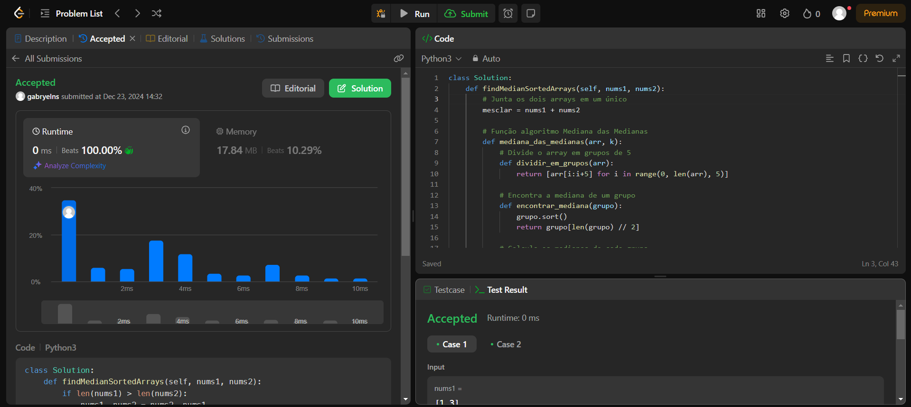
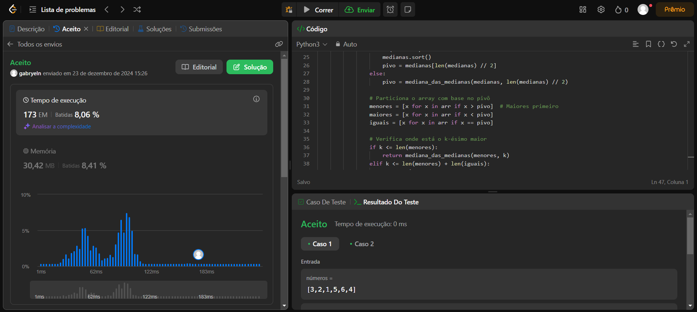

# D&C - LeetCode

**Número da Lista**: 62 
**Conteúdo da Disciplina**: Dividir e Conquistar 

## Alunos
| Matrícula | Aluno |
| -- | -- |
| 221022275  |  Felipe Amorim de Araújo |
| 221022570  |  Gabryel Nícolas Soares de Sousa |

## Sobre 
O projeto envolve a resolução de alguns problemas desafiadores do juiz online LeetCode envolvendo os conceitos estudados no conteúdo de Grafos 2 da disciplina de Projeto de Algoritmos. Os problemas resolvidos, links e resoluções podem ser encontrados na tabela a seguir:

| Nome do Problema | Link | Dificuldade | Resolução |
| -- | -- | -- | -- |
| Kth Largest Element in an Array | [LeetCode](https://leetcode.com/problems/kth-largest-element-in-an-array) | Medium | [Resolução](215_Kth_Largest_Element_in_an_Array/Solution.py) |
| Median of Two Sorted Arrays | [LeetCode](https://leetcode.com/problems/median-of-two-sorted-arrays/) | Hard | [Resolução](4_Median_of_Two_Sorted_Arrays/Solution.py) |
| Number of Pairs Satisfying Inequality | [LeetCode](https://leetcode.com/problems/number-of-pairs-satisfying-inequality/description/) | Hard | [Resolução](2426_number_of_pairs_satisfying_inequality/Solution.py) |
| Longest Substring with At Least K Repeating Characters | [LeetCode](https://leetcode.com/problems/longest-substring-with-at-least-k-repeating-characters/) | Medium | [Resolução](395_longest_substring_with_at_least_k_repeating_characters/Solution.py) |

## Screenshots
Median of Two Sorted Arrays

Kth Largest Element in an Array

## Instalação 
**Linguagens**: Python 

## Uso 
Para executar as resoluções, copie o código em cada arquivo e coloque no LeetCode, ou crie casos de testes para execução de cada arquivo

## Vídeo

<!-- link do video -->

